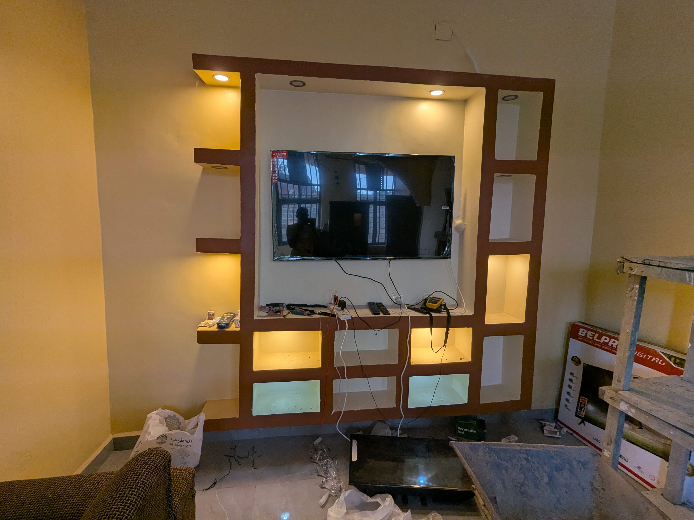
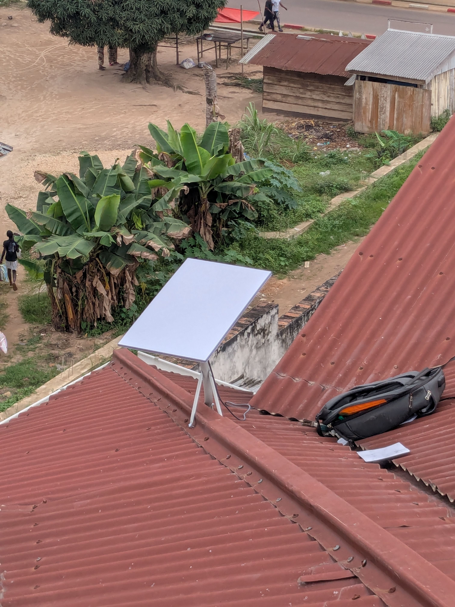

<html lang="fr">
<head>
    <meta charset="UTF-8">
    <meta name="viewport" content="width=device-width, initial-scale=1.0">
    <title>OLI'energie - Expertise & Solutions</title>
    <link href="https://fonts.googleapis.com/css2?family=Inter:wght@400;600;700;800&display=swap" rel="stylesheet">
    <link rel="stylesheet" href="https://cdnjs.cloudflare.com/ajax/libs/font-awesome/6.0.0/css/all.min.css">
    
    
</head>
<body>

<header>
    <h1>OLI'energie</h1>
    
Solutions Énergétiques & Services Techniques

</header>

    

        
        
        
        
        
    

    

        <h2>Nos Réalisations & Services</h2>
        
        
<i class="fas fa-bolt"></i> &nbsp; Électricité & Solaire

        <ul class="service-list">
            <li>Installation Panneaux</li>
            <li>Systèmes Batteries</li>
            <li>Maintenance Inverter</li>
            <li>Réseau SNEL / Groupe</li>
        </ul>

        
<i class="fas fa-satellite-dish"></i> &nbsp; Antennes & Wi-Fi

        <ul class="service-list">
            <li>Starlink Standard/Mini</li>
            <li>Canal+ / Startimes</li>
            <li>Configuration Wi-Fi</li>
            <li>TNT</li>
        </ul>

        
<i class="fas fa-tools"></i> &nbsp; Maintenance & Dépannage

        <ul class="service-list">
            <li>Réparation Électronique</li>
            <li>PC & Téléphones</li>
            <li>Maintenance Climatisation</li>
            <li>Montage Supports TV</li>
        </ul>

        
<i class="fas fa-lightbulb"></i> &nbsp; Décoration LED

        <ul class="service-list">
            <li>Profils LED Design</li>
            <li>Spots Encastrés</li>
            <li>Éclairage Intelligent</li>
        </ul>
    

    

        <h3 style="text-align:center;">Contactez l'expert</h3>
        <form action="https://formsubmit.co/olivierbobijules75@gmail.com" method="POST">
            <input type="hidden" name="_captcha" value="false">
            <input type="text" name="Nom" placeholder="Votre Nom" required>
            
            

                <select name="Pays" style="flex:1;">
                    <option value="+243">🇨🇩 RDC</option>
                    <option value="+33">🇫🇷 FR</option>
                    <option value="+32">🇧🇪 BE</option>
                </select>
                <input type="tel" name="Numero" placeholder="830998296" style="flex:2;" required>
            

            <select name="Service">
                <option>Solaire / Électricité</option>
                <option>Starlink / Wi-Fi</option>
                <option>Dépannage / Montage</option>
                <option>Décoration LED</option>
            </select>
            <textarea name="Message" rows="3" placeholder="Détails de votre projet..."></textarea>
            <button type="submit" class="btn-send">Envoyer la demande</button>
        </form>
        <a href="https://wa.me/243830998296" class="btn-whatsapp" target="_blank">
            <i class="fab fa-whatsapp"></i>&nbsp; WhatsApp Direct
        </a>
    

</body>
</html>
